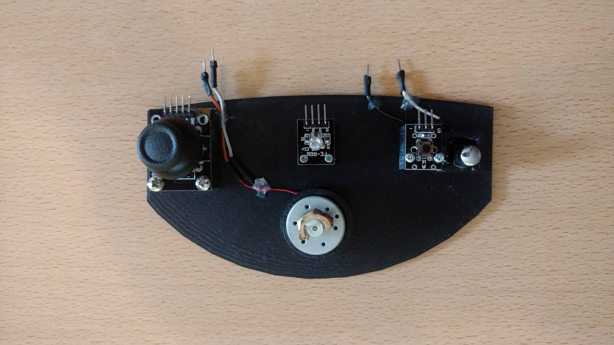
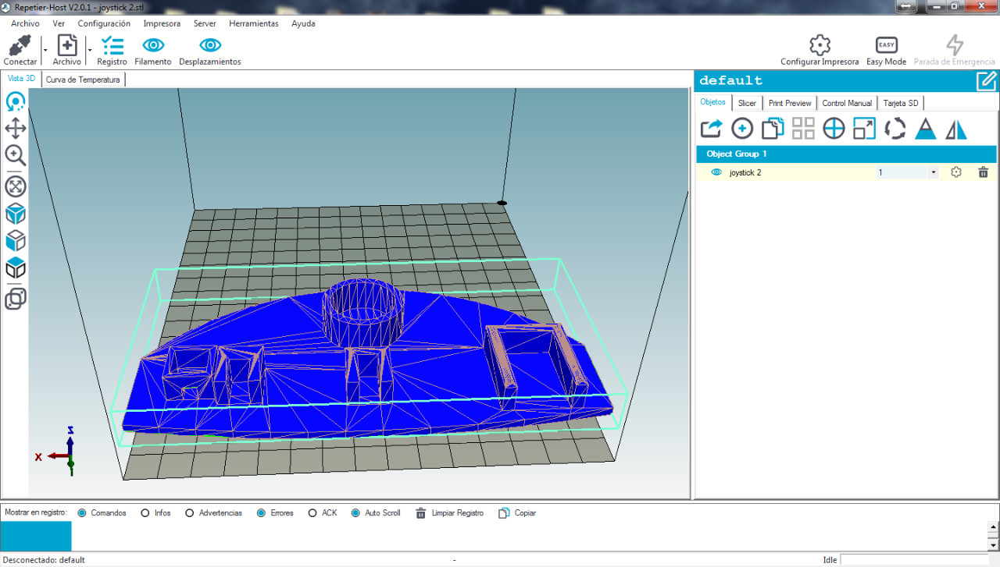
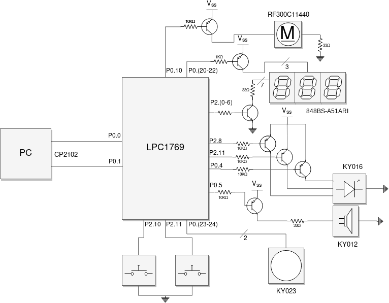
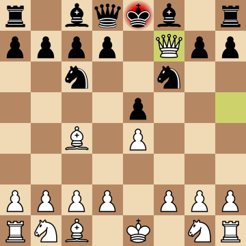

# Python-chess controller 

Trabajo Final de Electronica Digital 3 - FCEFyN - UNC

## Introduccion

La idea del proyecto es armar un módulo “joystick” utilizando la placa Nxp LPC1769, para controlar un juego de Ajedrez hosteado en una PC, hecho en Python. Además, la placa brindará información extra a los jugadores, como el tiempo total restante de cada jugador que se mostrará por 7 displays de 7 segmentos, indicará el turno de cada jugador o si se ha finalizado la partida o se ha cometido un error de movimiento de fichas. La placa recibirá información de los jugadores, como el movimiento en los ejes X e Y del joystick para manejar las fichas, un botón de selección, el paso de turno, etc. La placa, además deberá leer datos de la computadora para entregarle información a los jugadores.

## Materiales

* Placa Nxp LPC1769. 
* Módulo Joystick. Consta de dos potenciómetros que de acuerdo a la posición en la que se encuentre el joystick, entregarán distintos valores de voltaje a la salida.
* Pulsador. Un simple pulsador para controlar la selección de fichas para los movimientos y demás.
* Botón. Al finalizar el turno de cada jugador, se deberá presionar el botón para indicar el final del turno del jugador. 
* Displays de 7 segmentos (3). En los displays se mostrará el tiempo restante total del jugador de turno.
* LED RGB. Indicará el turno del jugador. Al iniciar la partida ambos jugadores podrán elegir el color que desean y el led les indicará de quién es el turno.
* Buzzer. Un simple buzzer que actuará como indicador de final de la partida, error en el movimiento de la ficha, etc.
* Módulo USB-UART CP2102.
* Computador con Python 2/3 instalado. El juego correrá en la computadora, hecho en Python.
* Resistencias, transistores, etc. Lo necesario para el correcto armado y funcionamiento del proyecto.
* Impresora 3D. La base fue impresa utilizando una impresora 3D.

## Funcionamiento

1. Desde la placa realizaremos la conexión mediante el módulo UART a la PC, utilizando el CP2102. 
2. Con el ADC de la placa seteado en modo ráfaga, en los canales AD.0 y AD.1 convertiremos los valores analógicos entregados por el joystick a valores digitales que serán pasados a la PC para indicar los movimientos verticales u horizontales. 
3. El pulsador simplemente será leído por la placa en caso de generarse una interrupción externa y se enviará el dato a la computadora que servirá para indicar los movimientos de las fichas. 
4. El LED RGB brillará con la codificación de colores correspondiente al jugador de turno.
5. Usando el Timer de la placa, se contará el tiempo del que cada jugador dispone y se irá mostrando el tiempo restante en los displays para simular una partida de ajedrez en modo “Blitz”. 
6. Cuando el jugador finalice con su turno, deberá pulsar el botón para indicar que terminó su turno, en cuyo caso la placa leerá este dato, también por interrupción externa y cambiará el valor desplegado en los displays y cambiará la codificación de colores del LED RGB para indicar que es el turno del otro jugador. 
7. El buzzer indicará el final de la partida, ya sea porque un jugador ha agotado su tiempo o porque la partida ha finalizado. Además, indicará cualquier error, ya sea de movimiento inválido o demás.  
8. Habrá un motor de DC que será ajustado para vibrar e indicar ciertas situaciones que se pueden dar, como por ejemplo, final de la partida.

## Desarrollo y construccion

Se implementó el joystick con sus respectivos módulos y el producto final se muestra a continuación:

*Figura 1. Joystick Construido*

La parte de los displays y el buzzer, fue armada por separado con el fin de no agobiar el joystick con demasiados módulos. La base de la construcción fue diseñada e impresa con una impresora 3D. 
A continuación, se presenta el diseño realizado para la base: 

*Figura 2. Diseño de la base del joystick*

El conexionado de los periféricos se realizó como se indica en el siguiente diagrama ilustrativo:

*Figura 3. Esquema de conexion del circuito*

Una vez armado el joystick, el juego se ejecuta en una pc y está hecho en Python. La pc recibe el input que la placa le envía por UART a USB por medio del módulo USB-UART CP2102. Se debió implementar una interfaz para leer los comandos ingresados y enviar tramas serie de vuelta a la placa. El juego que se probó, Python-chess, es de código abierto. Fue necesario realizarle modificaciones para poder adaptarlo a nuestro proyecto.

*Figura 4. Python-chess*

# Autores

* [Juan Soriano](https://www.github.com/SorianoJuan)
* [Ivan Vignolles](https://www.github.com/ivanvig)
