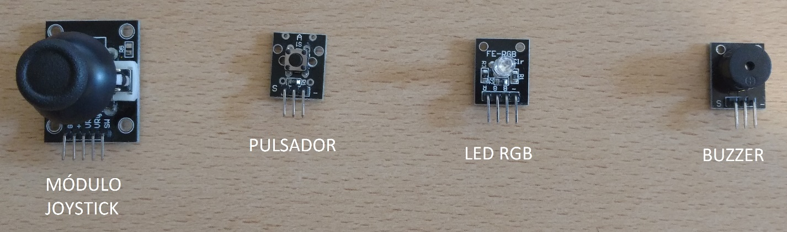
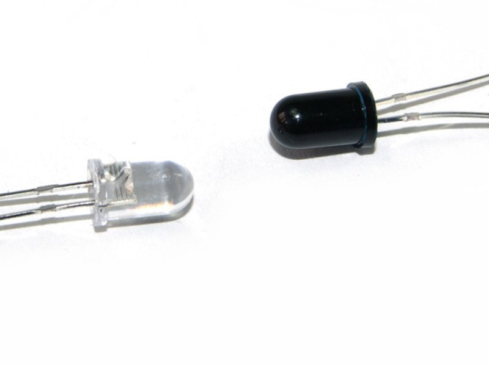

# Python-chess controller 

Trabajo Final de Electronica Digital 3

## Introduccion

La idea del proyecto es armar un módulo “joystick” utilizando la placa Nxp LPC1769, para controlar un juego de Ajedrez hosteado en una PC, hecho en Python utilizando la libreria [Python-Chess](https://github.com/niklasf/python-chess). Además, la placa brindará información extra a los jugadores, como el tiempo total restante de cada jugador, indicará el turno de cada jugador o si se ha finalizado la partida o se ha cometido un error de movimiento de fichas. La placa recibirá información de los jugadores, como el movimiento en los ejes X e Y del joystick para manejar las fichas, un botón de selección, el paso de turno, etc. La placa, además deberá leer datos de la computadora para entregarle información a los jugadores.

## Materiales

* Placa Nxp LPC1769. 
* Módulo Joystick. Consta de dos potenciómetros que de acuerdo a la posición en la que se encuentre el joystick, entregarán distintos valores de voltaje a la salida.
* Pulsador. Un simple pulsador para controlar la selección de fichas para los movimientos y demás.
* Displays de 7 segmentos (3). En los displays se mostrará el tiempo restante total del jugador de turno.
* Par Emisor-Receptor. Al finalizar el turno de cada jugador, deberá pasar la mano entre el par para indicar el final de su turno, pausar su contador e iniciar el del otro jugador. 
* LED RGB. Indicará el turno del jugador. Al iniciar la partida ambos jugadores podrán elegir el color que desean y el led les indicará de quién es el turno.
* Buzzer. Un simple buzzer que actuará como indicador de final de la partida, error en el movimiento de la ficha, etc.
* Módulo USB-UART CP2102.
* Computador con Python 2/3 instalado. El juego correrá en la computadora, hecho en Python.
* Resistencias, transistores, etc. Lo necesario para el correcto armado y funcionamiento del proyecto.

## Funcionamiento

1. Desde la placa realizaremos la conexión mediante el módulo UART a la PC, utilizando el CP2102. 
2. Con el ADC de la placa, convertiremos los valores analógicos entregados por el joystick a valores digitales que serán pasados a la PC para indicar los movimientos verticales u horizontales. 
3. El pulsador simplemente será leído por la placa en caso de generarse una interrupción externa y se enviará el dato a la computadora. 
4. El LED RGB brillará con la codificación de colores correspondiente al jugador de turno. Esta codificación será configurable al iniciar la partida.
5. Usando el Timer de la placa, se contará el tiempo del que cada jugador dispone y se irá mostrando el tiempo restante en los displays para simular una partida de ajedrez en modo “Blitz”. 
6. Cuando el jugador finalice con su turno, deberá pasar la mano entre el par Emisor-Receptor para indicar que terminó su turno, en cuyo caso la placa leerá este dato, también por interrupción externa o por GPIO, y cambiará el valor desplegado en los displays y cambiará la codificación de colores del LED RGB para indicar que es el turno del otro jugador. 
7. El buzzer indicará el final de la partida, ya sea porque un jugador ha agotado su tiempo o porque la partida ha finalizado. Además, indicará cualquier error, ya sea de movimiento inválido o demás.  

# Autores

* [Juan Soriano](www.github.com/SorianoJuan)
* [Ivan Vignolles](www.github.com/ivanvig)
